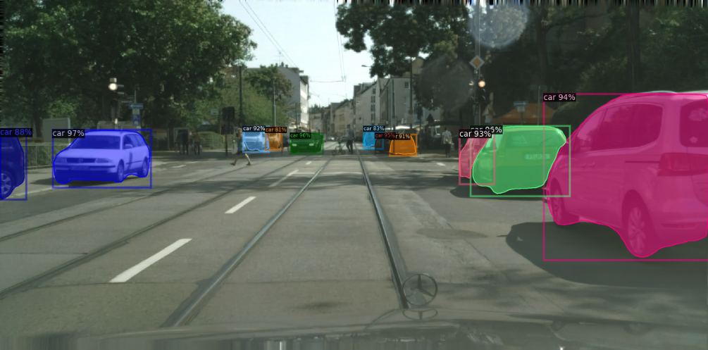

# VCT for VCM on Cityscapes dataset
This is part 2 of my research internship. This is not a standalone part and must be preceded by part 1 as the trained weights from part 1 are needed here. The aim of this part is to fix the ELIC weights from part 1, thus preserving the segmentation fidelity and then train the temporal entropy model of the VCT using the video data from Cityscapes dataset to achieve more efficient compression rates.

# Environment Setup
Please refer to README_VCT.md for environment setup.

# How to Use

First, add path of Cityscapes dataset in _cityscapes.yaml_. Note that since this operates on video, we need the dataset which contains all individual frames of the clips captured, and not only the ones with ground truth available.

Use _train.py_ to insert the ELIC weights from part 1 and then to train the temporal entropy model. You can change the training parameters in the appropriate config file. You need to provide the path to the checkpoint file created when running _main.py_ in part 1 in _detectron2_weights_complete_path_.

# Testing

To test, run the _evaluate.py_ (I know it says train, but it will test). Provide the path to the trained VCT module from _train.py_ in _checkpoint_path_. You can select the max number of clips from the validation set in the _evaluate_dataset_bpp_psnr_ function. This will give you the average PSNR and average BPP values. To see visualization result on 1 clip, use: _modelmodule.test_step_. 

# Results
The results shown below are from both _transformer-video-coding-Part1_ and _transformer-video-coding-Part2_:

Instance segmentation being performed on a sample image
from the Cityscapes validation set which is compressed and subsequently
decompressed. Different instances are highlighted
with distinct colors and corresponding class labels. PSNR ~ 34 and bpp ~ 0.3.

Average Precision (AP) and AP at 50% IoU threshold (AP50) for each category
in the original (uncompressed) validation images.

Experimental results: PSNR, BPP (Image), BPP (VCT) and wAP for different
values of λ2.

Rate–Distortion (RD) curve showing PSNR versus BPP for the image-based and the video-based VCT compression model.

Curve showing weighted Average Precision versus BPP for the image-based and the video-based VCT compression model.

# Additional Info:
If you need any checkpoint file, please email me at: harisasif64@gmail.com
